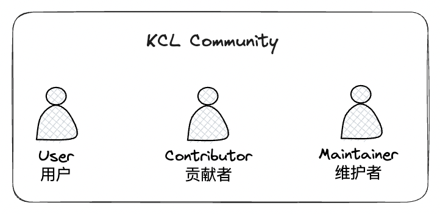

# KCL Community Roles

This document describes the set of roles individuals may have within the KCL community.

## User

A ***user*** is someone that uses KCL. They contribute to KCL projects by providing feedback to developers in the form of bug reports and feature suggestions. Users participate in the KCL community by helping other users.

## Contributor

A ***contributor*** is a user who contributes to the project in the form of code or documentation. They take extra steps to participate in a project, are active on the community, participate in discussions, provide patches, documentation, suggestions, and criticism.

## Maintainer

A Maintainer has the ability to merge code into the KCL project. Maintainers are active Contributors and participants in the projects. In order to become a Maintainer, you must be nominated and approved by the established Maintainers. Maintainers have write access to the KCL repos on GitHub.
